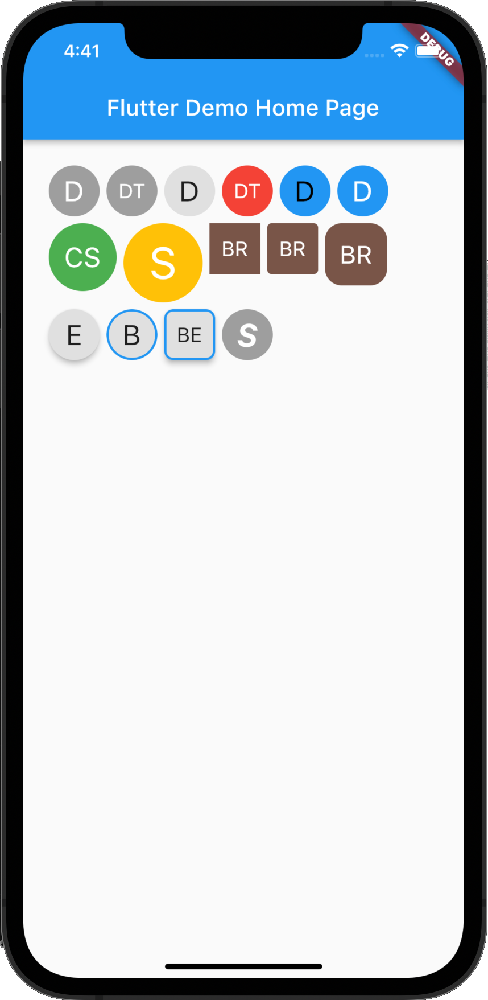

# flutter_initicon

[](https://pub.dev/packages/flutter_initicon)
[](https://opensource.org/licenses/MIT)

Initicon are used to show the initials of the name of users who do not have an avatar or profile image.
## Screenshot

|              Examples               |
| :-----------------------------: |
|  |


## Getting Started

### Adding package

```yaml
flutter_initicon: ^1.0.3
```

### Importing package

```yaml
import 'package:flutter_initicon/flutter_initicon.dart';
```

## Example

```dart
import 'package:flutter/material.dart';

void main() {
    return runApp(MyApp());
}

class MyApp extends StatelessWidget {
    @override
    Widget build(BuildContext context) {
        return MaterialApp(
                title: 'Flutter Demo',
                theme: ThemeData(
                    primarySwatch: Colors.blue,
                ),
                home: MyHomePage(title: 'Flutter Demo Home Page'),
            );
    }
}

class MyHomePage extends StatefulWidget {
    MyHomePage({Key key, this.title}) : super(key: key);

    final String title;

    @override
    _MyHomePageState createState() => _MyHomePageState();
}

class _MyHomePageState extends State<MyHomePage> {
    
    @override
    Widget build(BuildContext context) {
        return Scaffold(
            appBar: AppBar(
                title: Text(widget.title),
            ),
            body: Center(
                child: Initicon(
                  text: "Full Name",
                ),
            ),
        );
    }
}
```

## License

    MIT License
